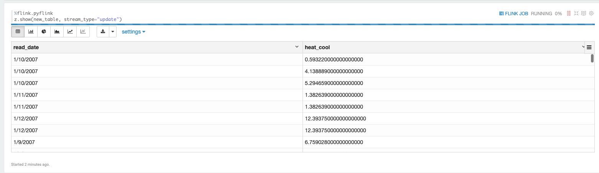
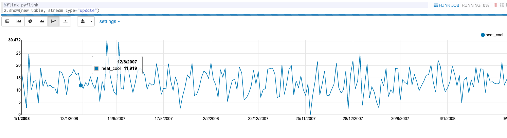

# aws_kinesis codes and photos
[Power dataset](https://archive.ics.uci.edu/ml/datasets/individual+household+electric+power+consumption)
Contains:
* code to put records in Kinesis Data Stream (Python boto3)
* code for streaming SQL application (legacy) of Kinesis Analytics
* code for streaming in Zeppelin (notebook-type) using Studio notebooks of Kinesis Analytics
* **Note**: for Zeppelin, additional permission to access Kinesis must be configured manually
* Sample photos of Zeppelin 

